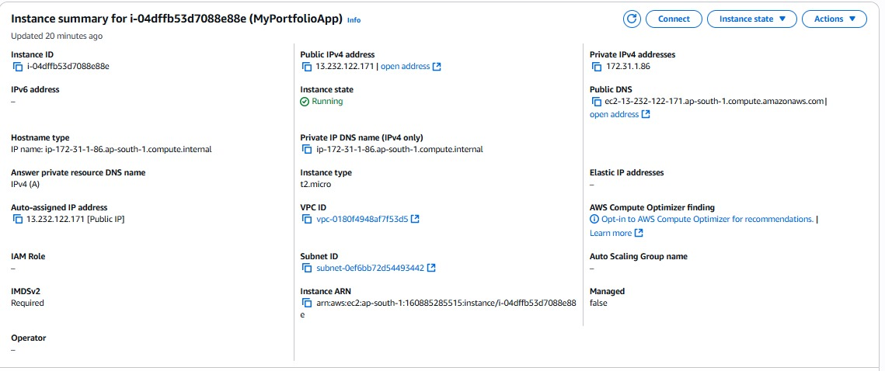
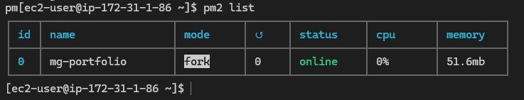
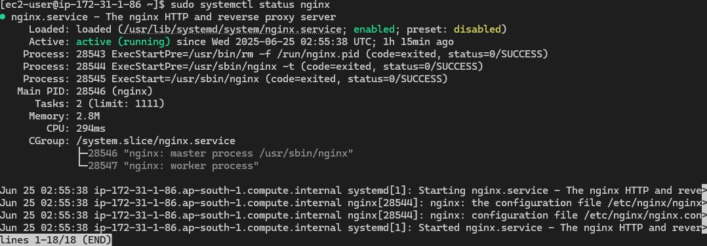
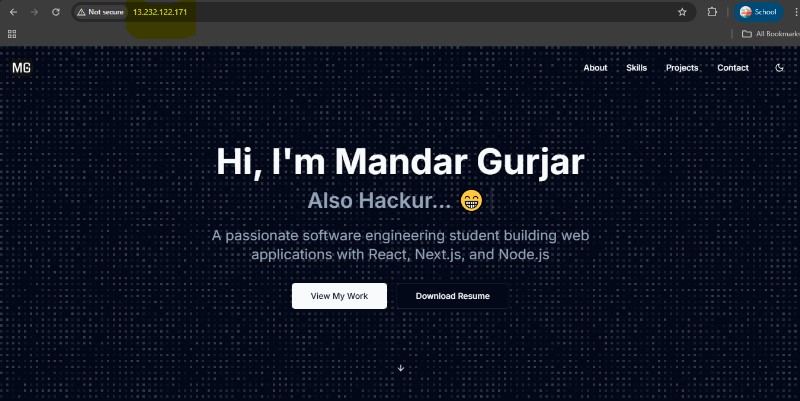

# 🚀 My Portfolio  

Welcome to my portfolio repository! This project showcases my work, skills, and projects. Feel free to explore and get a glimpse of what I do.  

## 🌟 Features  

- Showcases my projects and experience  
- Fully responsive design  
- Built with modern web technologies  

## 🛠️ Tech Stack  

- **Frontend:** Next.js, React, TailwindCSS  
- **Backend:** Prisma, PostgreSQL, nodemailer, nodejs 

## 📬 Get in Touch  

You can connect with me through the **Get in Touch** section on my portfolio. I’d love to hear from you!

## 🤖 Competitive Programming Scores - A Confession and Invitation

The competitive programming section of this portfolio currently requires manual updates for scores from platforms like LeetCode, HackerRank, and CodeChef. This means the scores you see here are static and may not always reflect the latest achievements.

If you are interested in contributing, I warmly invite you to help enhance this section by adding APIs or automation scripts that can fetch and update these scores automatically. Your contributions will make this portfolio more dynamic and up-to-date!

Feel free to open a pull request or reach out if you want to collaborate on this feature.

---

## 🚀 Deployment and Hosting

This project is deployed on an AWS EC2 instance and is accessible publicly at: [http://13.232.122.171](http://13.232.122.171)

You can also find this public IP address in the description section of this repository for quick access.

### AWS EC2 Deployment

The application is hosted on an Amazon Web Services (AWS) EC2 instance. This provides a scalable and reliable environment for running the portfolio website. The EC2 instance is configured to be publicly accessible via its unique public IP address.

### Nginx as Reverse Proxy

Nginx is set up as a reverse proxy server in front of the application. It listens for incoming HTTP requests on standard ports and forwards them to the application running on the backend. This setup enhances security by hiding the application server details, improves performance through caching and load balancing capabilities, and simplifies SSL/TLS termination.

---

## 📸 Proof of Deployment

Below are proofs that demonstrate the application is running live on the EC2 instance:

### 1. EC2 Instance Live and Accessible (AWS Console)

*This screenshot from the AWS Management Console shows the EC2 instance in a running state. The public IP address is clearly highlighted, which matches the IP used to access the application. This confirms that the instance is live and accessible.*

### 2. PM2 Process List (SSH Terminal)

*This terminal screenshot shows the PM2 process manager running on the EC2 instance. The `mg-portfolio` application is listed as an active process, indicating that the application is being managed and kept alive by PM2.*

### 3. Nginx Service Status (SSH Terminal)

*This screenshot shows the status of the Nginx service on the EC2 instance. The service is active and running, confirming that Nginx is properly set up to act as a reverse proxy for the application.*

### 4. Application Accessible in Browser

*This image shows the application being accessed through a web browser using the public IP address. It demonstrates that the application is live and reachable from the internet.*

---

## 🔮 Future Scope

Looking ahead, there are plans to implement local load balancing within the EC2 instance. This will involve running multiple instances of the application on different ports. Traffic will be intelligently distributed across these instances based on current load, improving the application's availability, scalability, and responsiveness.

---
