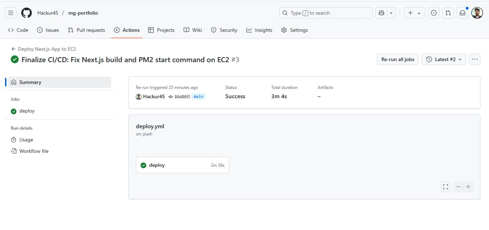
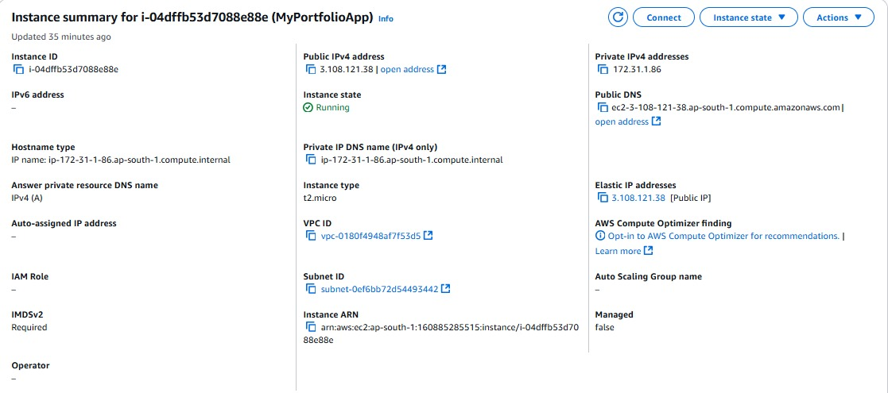
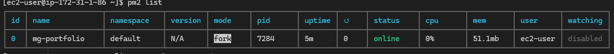
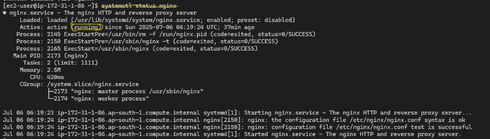
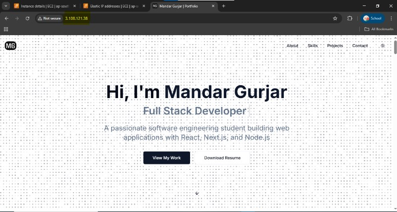

# 🚀 My Portfolio

Welcome to my portfolio repository! This project showcases my work, skills, and projects, built with modern web technologies and deployed automatically via a robust CI/CD pipeline. Feel free to explore and get a glimpse of what I do.

---

## Table of Contents

- [🚀 My Portfolio](#-my-portfolio)
  - [Table of Contents](#table-of-contents)
  - [🌟 Features](#-features)
  - [🛠️ Tech Stack](#️-tech-stack)
  - [🚀 Deployment and Hosting](#-deployment-and-hosting)
    - [AWS EC2 Instance Configuration](#aws-ec2-instance-configuration)
    - [CI/CD Pipeline with GitHub Actions](#cicd-pipeline-with-github-actions)
  - [📸 Proof of Deployment](#-proof-of-deployment)
    - [1. GitHub Actions Workflow Success (REQUIRED)](#1-github-actions-workflow-success-required)
    - [2. EC2 Instance Live and Accessible (AWS Console)](#2-ec2-instance-live-and-accessible-aws-console)
    - [3. PM2 Process List (SSH Terminal)](#3-pm2-process-list-ssh-terminal)
    - [4. Nginx Service Status (SSH Terminal)](#4-nginx-service-status-ssh-terminal)
    - [5. Application Accessible in Browser](#5-application-accessible-in-browser)
  - [📬 Get in Touch](#-get-in-touch)
  - [🤖 Competitive Programming Stats - Beyond Manual Updates](#-competitive-programming-stats---beyond-manual-updates)
  - [🔮 Future Scope](#-future-scope)
  - [Troubleshooting Common Issues](#troubleshooting-common-issues)
  - [License](#license)

---

## 🌟 Features

* Showcases my projects and professional experience
* Fully responsive and adaptive design for various devices
* Built with cutting-edge web technologies
* [Add any other specific features, e.g., "Interactive portfolio items," "Contact form functionality"]

## 🛠️ Tech Stack

This project leverages a modern and powerful technology stack:

* **Frontend:** Next.js, React, Tailwind CSS
* **Backend (if applicable/used for any features):** Prisma, PostgreSQL, Node.js, Nodemailer
---

## 🚀 Deployment and Hosting

This project is deployed on an AWS EC2 instance and is continuously delivered via GitHub Actions. It is accessible publicly at: [http://3.108.121.38](http://3.108.121.38)

You can also find the public IP address in the description section of this repository for quick access.

### AWS EC2 Instance Configuration

The application is hosted on an Amazon Web Services (AWS) EC2 instance, providing a scalable and reliable environment.

* **Elastic IP (Recommended):** For consistent deployments, it's highly recommended to assign an **Elastic IP** to your EC2 instance. Without an Elastic IP, your instance's public IP address changes every time you stop and start it. This would break your GitHub Actions pipeline, as the `EC2_HOST` secret would become outdated, leading to "connection timeout" errors during deployment. An Elastic IP provides a static, public IPv4 address that remains associated with your account until you release it, even if you stop and start the instance.
* **Instance Type:** Primarily developed and optimized for `t2.micro` instances.
* **Node.js & npm:** Installed for application runtime and package management.
* **PM2:** Utilized as a production process manager to keep the Next.js application running continuously, handle restarts on crashes, and manage logs.
* **Swap Space:** Critically, 4GB of swap space has been configured on the EC2 instance to accommodate the memory-intensive Next.js build process, especially on lower-memory instance types like `t2.micro`.
* **Nginx as Reverse Proxy:** Nginx is set up to listen for incoming HTTP/S requests on standard ports (80/443) and intelligently forward them to the Next.js application running on `localhost:3000`. This setup enhances security, improves performance, and simplifies SSL/TLS termination.

### CI/CD Pipeline with GitHub Actions

The deployment process is fully automated using GitHub Actions. Any push to the `main` branch triggers a workflow (`.github/workflows/deploy.yml`) that handles the entire deployment cycle:

1.  **Code Checkout:** Fetches the latest source code from your repository.
2.  **Dependency Installation (on EC2):** Connects to the EC2 instance and runs `npm install` (a full installation, including `devDependencies`) to ensure all necessary packages for both building and running the application are present.
3.  **Next.js Production Build (on EC2):** Executes `npm run build` directly on the EC2 instance to create an optimized production build of the Next.js application. This ensures environment consistency.
4.  **Application Management with PM2:**
    * Deletes any existing PM2 process for the application to ensure a clean restart with updated configurations.
    * Starts the Next.js application using PM2 with robust settings (e.g., `max-restarts` limit of 5 attempts) to prevent infinite restart loops in case of application errors.
    * Saves the PM2 process list for persistence across server reboots.

**GitHub Actions Secrets:**

This CI/CD pipeline relies on **GitHub Secrets** for securely storing sensitive information. These secrets are configured in your GitHub repository under `Settings` > `Secrets and variables` > `Actions`:

* `EC2_HOST`: The **Public IPv4 address or Elastic IP** of your EC2 instance. This *must* be kept up-to-date, especially if you're not using an Elastic IP.
* `EC2_USER`: The SSH username for your EC2 instance (e.g., `ec2-user` for Amazon Linux, `ubuntu` for Ubuntu).
* `EC2_SSH_KEY`: The **private part** of your SSH key pair. It should be copied exactly, including the `-----BEGIN` and `-----END` lines and all newlines.
* `PM2_APP_NAME`: The desired name for your PM2 process (e.g., `mg-portfolio`).

**Key Deployment Script Block (from `.github/workflows/deploy.yml`):**

The core logic for deploying and managing the application on the EC2 instance resides in the `script` block of the `Deploy and Restart Application on EC2` step:

```yaml
# ... (inside the 'Deploy and Restart Application on EC2' step)
script: |
  set -e # Exit immediately if any command fails

  cd /var/www/nextjs-app

  echo "Pulling latest code from Git (for consistency)..."
  git pull origin main

  echo "Installing ALL Node.js dependencies for build and runtime on EC2..."
  npm install # Crucial for build-time dependencies

  echo "Building Next.js application on EC2..."
  npm run build

  echo "Deleting old PM2 process '${{ secrets.PM2_APP_NAME }}' if it exists..."
  pm2 delete ${{ secrets.PM2_APP_NAME }} || true

  echo "Starting PM2 process '${{ secrets.PM2_APP_NAME }}' with restart limits..."
  pm2 start npm --name "${{ secrets.PM2_APP_NAME }}" \
    --max-restarts 5 \
    -- run start # Correct syntax for PM2 options and running npm script

  echo "Saving PM2 process list..."
  pm2 save

  echo "Deployment successful on EC2!"
````

This automation ensures rapid, consistent, and reliable deployments without manual intervention.

-----

## 📸 Proof of Deployment

Below are proofs demonstrating the application's live status and the automated deployment process:

### 1\. GitHub Actions Workflow Success (REQUIRED)



*This screenshot from the GitHub Actions dashboard shows a successful run of the `Deploy Next.js App to EC2` workflow, confirming the automated pipeline completed without errors.*

### 2\. EC2 Instance Live and Accessible (AWS Console)


*This screenshot from the AWS Management Console shows the EC2 instance in a running state. The public IP address is clearly highlighted, which matches the IP used to access the application. This confirms that the instance is live and accessible.*

### 3\. PM2 Process List (SSH Terminal)

*This terminal screenshot shows the PM2 process manager running on the EC2 instance. The `mg-portfolio` application is listed as an active process, indicating that the application is being managed and kept alive by PM2, ensuring its continuous operation.*

### 4\. Nginx Service Status (SSH Terminal)


*This screenshot shows the status of the Nginx service on the EC2 instance. The service is active and running, confirming that Nginx is properly set up to act as a reverse proxy for the application.*

### 5\. Application Accessible in Browser

*This image shows the application being successfully accessed through a web browser using the public IP address/domain. It demonstrates that the application is live and reachable from the internet.*

-----

## 📬 Get in Touch

You can connect with me through the **Get in Touch** section on my portfolio. I'd love to hear from you!

---

## 🤖 Competitive Programming Stats - Beyond Manual Updates

This portfolio now dynamically fetches competitive programming statistics to provide more up-to-date insights into my performance.

**Current Implementation:**
* **LeetCode Stats:** Utilizes **GraphQL** to fetch real-time statistics from LeetCode.
* **Codeforces Stats:** Integrates with the **Codeforces API** to display user information and the number of problems solved.

**Current Challenges & Future Enhancements:**
While the initial integration is a significant step, there are areas for improvement and expansion:

1.  **Client-Side Loading:** Currently, the data fetching and rendering for these statistics are primarily done on the client side. This can sometimes lead to **slower loading times** and a less optimal user experience. We aim to explore server-side rendering (SSR) or static site generation (SSG) for this section to improve performance.
2.  **Platform Expansion:** Stats are currently limited to LeetCode and Codeforces. The goal is to **integrate more competitive programming platforms** (e.g., HackerRank, CodeChef) to offer a broader view of my achievements.
3.  **Automation & Optimization:** Further automation and optimization of the fetching process can ensure quicker updates and better resource utilization.

**Invitation to Collaborate:**
If you're interested in contributing to make this section even more robust, dynamic, and comprehensive, I warmly invite you to help! Contributions could include:

* Implementing server-side data fetching strategies.
* Integrating APIs for additional competitive programming platforms.
* Optimizing existing data retrieval and display.

Feel free to open a pull request or reach out if you want to collaborate on these exciting features.

-----

## 🔮 Future Scope

Looking ahead, there are plans to implement further enhancements for scalability and resilience:

  * **Local Load Balancing:** Running multiple instances of the application on different ports within the EC2 instance, with traffic intelligently distributed across them based on current load, improving availability and responsiveness.
  * **Auto-scaling:** Exploring the use of AWS Auto Scaling Groups to automatically adjust the number of EC2 instances based on demand, ensuring high availability and cost efficiency.
  * **Monitoring & Alerting:** Implementing robust monitoring solutions to track application performance and setting up alerts for any anomalies.

-----

## Troubleshooting Common Issues

Here are some common issues encountered during this setup and their resolutions. This section is based on real-world debugging experiences with this specific deployment:

  * **`dial tcp ...:22: i/o timeout` (during `appleboy/scp-action` or `ssh-action`):**

      * **Cause:** GitHub Actions runner cannot reach your EC2 instance on port 22 (SSH).
      * **Resolution:**
        1.  Verify your EC2 instance is `running` and get its **current Public IPv4 address**.
        2.  **Update the `EC2_HOST` secret** in GitHub if the IP has changed (most common if not using Elastic IP).
        3.  Check your EC2 instance's **Security Group inbound rules** to ensure Port 22 (SSH) is open to the necessary IP ranges (your local IP, GitHub Actions IPs, or temporarily `0.0.0.0/0`).

  * **`Module not found: Can't resolve '@/components/...'` (during `npm run build` on EC2):**

      * **Cause:** `devDependencies` required for the Next.js build process (like TypeScript, PostCSS plugins) were not installed. This often happens if `npm install --production` was used.
      * **Resolution:** Ensure your EC2 deployment script uses `npm install` (without `--production` or `--omit=dev`) to install all necessary packages.

  * **`Killed` or build process hangs (during `npm run build` on EC2):**

      * **Cause:** Out of memory during the Next.js build process, especially on `t2.micro` instances.
      * **Resolution:** Add sufficient **swap space** to your EC2 instance. (Refer to [AWS EC2 Instance Configuration](https://www.google.com/search?q=%23aws-ec2-instance-configuration) above for instructions).

  * **`sh: line 1: next: command not found` or `Invalid project directory provided: .../5` (during `pm2 start` on EC2):**

      * **Cause:** Incorrect `pm2 start` command syntax, specifically how arguments were passed to `npm run start` or how PM2's own options were applied.
      * **Resolution:** Ensure the `pm2 start` command is correctly structured, with PM2 options before `--` and the script command (`run start`) after `--`. (Refer to the [Key Deployment Script Block](https://www.google.com/search?q=%23ci/cd-pipeline-with-github-actions) above for the correct syntax).

  * **`502 Bad Gateway` (if using Nginx):**

      * **Cause:** Nginx is running but cannot connect to your Next.js application (which might not be running or is on a different port).
      * **Resolution:**
        1.  Check `pm2 list` on your EC2 to confirm `mg-portfolio` is `online`.
        2.  Check application logs: `pm2 logs mg-portfolio --lines 50` for any errors from Next.js.
        3.  Verify your Nginx configuration `proxy_pass` is pointing to the correct address and port (usually `http://localhost:3000`).

-----

## Credits

- **Base Frontend**: This portfolio's frontend design is based on a template generated using [v0.dev](https://v0.dev), which provided a clean and well-structured starting point for the UI.
- **Cloud Configuration**: All deployment tasks, environment setup, hosting, and domain configurations were handled by me — Mandar Gurjar.
- **Backend Features**:
  - **Contact Section**: I developed the backend logic to handle form submissions and manage incoming messages effectively.
  - **Competitive Programming Section**: This section dynamically displays profile stats, currently integrated with a limited number of platforms.

### About the Stats Repository

The data for the Competitive Programming section is intended to be powered by [your-stats-repo](https://github.com/Hackur45/competitive-programming-stats-collector), an open-source project aimed at collecting real-time stats from various competitive programming platforms. As of now, it supports only two platforms (LeetCode and Codeforces), so it's not yet fully integrated into the live portfolio.

**I welcome contributions** to this repository — whether it's adding support for new platforms like CodeChef, AtCoder, HackerRank, etc., or improving the existing codebase. If you're interested in open-source and competitive programming, this is a great project to get involved with. Your help would accelerate full integration into the portfolio.

---

> Built with care and curiosity by Mandar Gurjar

## License

This project is licensed under the MIT License - see the `LICENSE` file for details.

